# Splunk Windows Security SOC Lab

A hands-on SOC investigation project using Splunk Enterprise and Windows Security event logs.

The project involved ingesting and configuring Windows Security logs in Splunk, investigating authentication and account activity, identifying suspicious behaviour, creating SPL-based detection searches, and building a SOC dashboard to visualise key security events.

## SOC Dashboard

The final dashboard provides an overview of the Windows Security dataset and highlights authentication and account activity identified during the investigation.

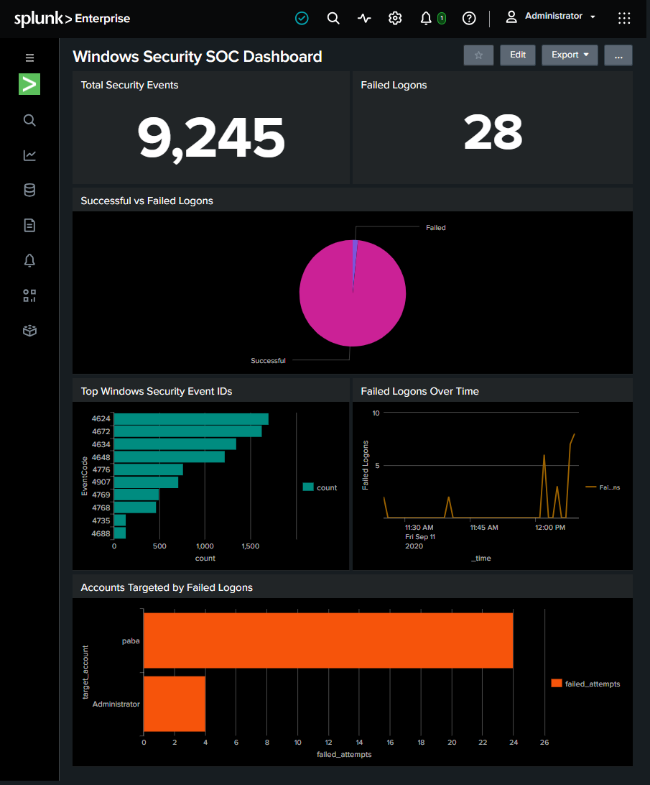

## Project Overview

The dataset contains **9,245 Windows Security events** from a simulated Active Directory environment.

I used Splunk to investigate the event data and identify activity involving the `paba` account and the source IP address `95.90.199.65`.

The investigation focused on:

- Windows authentication activity
- Failed and successful logons
- Account creation and modification
- Privileged logon activity
- Explicit credential usage
- Repeated authentication failures
- Rapid use of newly created accounts

The investigation was then used to create detection searches for suspicious authentication behaviour.

## Tools and Technologies

- Splunk Enterprise
- Search Processing Language (SPL)
- Windows Security Event Logs
- Windows Event IDs
- GitHub

## Data Ingestion

Windows Security event data was ingested into a dedicated Splunk index:

```text
index="soc_lab"
sourcetype="windows_security"
```

The dataset contained **9,245 events** covering a range of Windows Security Event IDs.

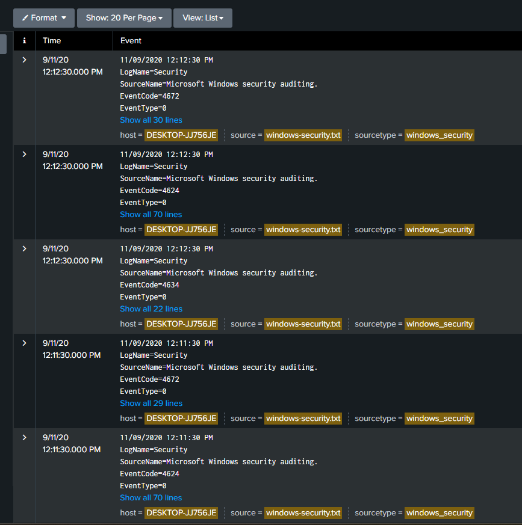

An initial event distribution search was used to understand which Windows events appeared most frequently:

```spl
index="soc_lab" sourcetype="windows_security"
| stats count by EventCode
| sort - count
```

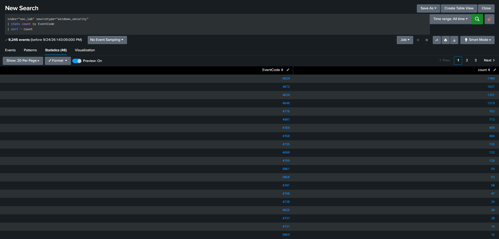

## Investigation

### Failed Logon Activity

Windows Event ID **4625** was investigated to identify failed authentication attempts.

The results showed:

- `paba` – 24 failed logon attempts from `95.90.199.65`
- `Administrator` – 4 failed logon attempts

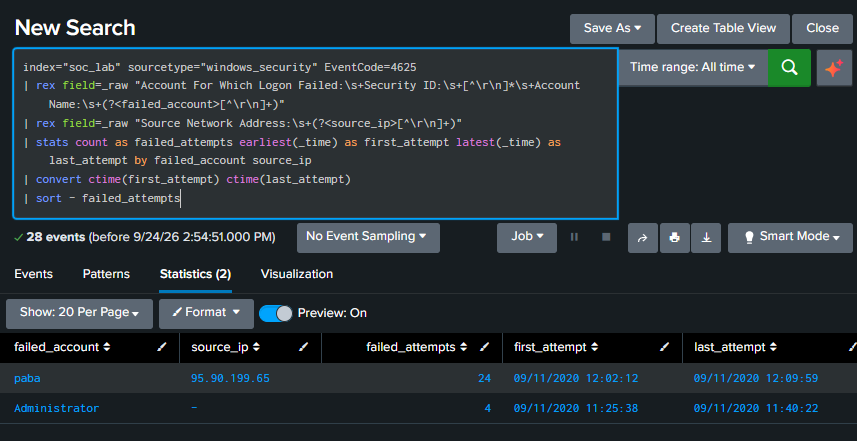

This led to further investigation of authentication activity associated with `paba`.

### Successful Logons

Event ID **4624** was used to investigate successful logons associated with the account.

The results also contained different logon types and authentication packages, including NTLM, Kerberos, and Negotiate.

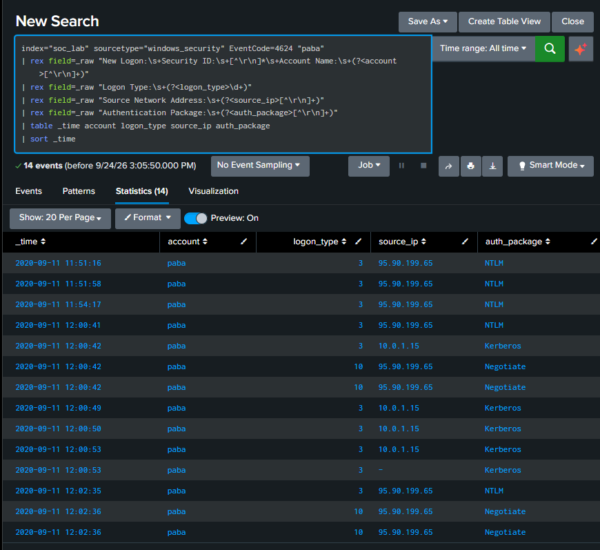

Combining successful and failed authentication events provided a clearer view of the sequence of activity.

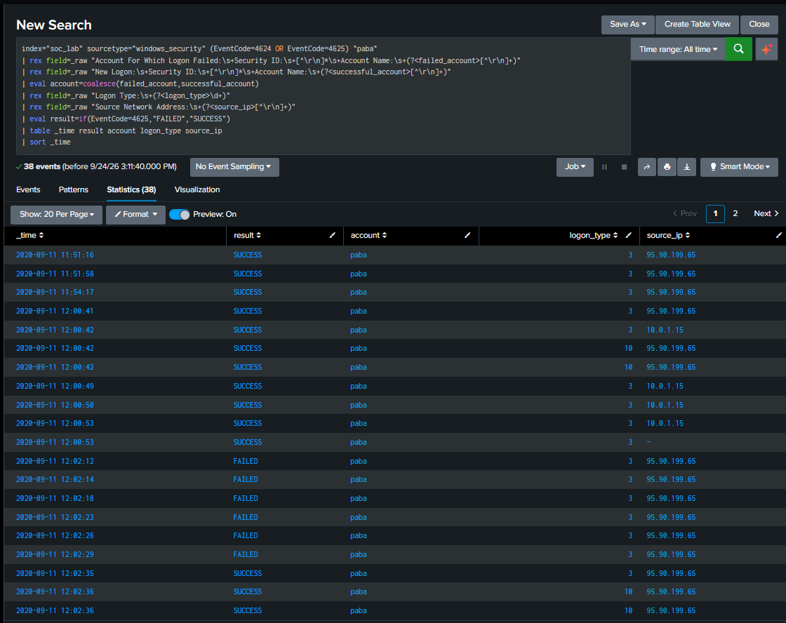

### Privileged Sessions

Event ID **4672** records special privileges assigned to a new logon.

The investigation identified Event ID 4672 records associated with logon sessions for `paba`.

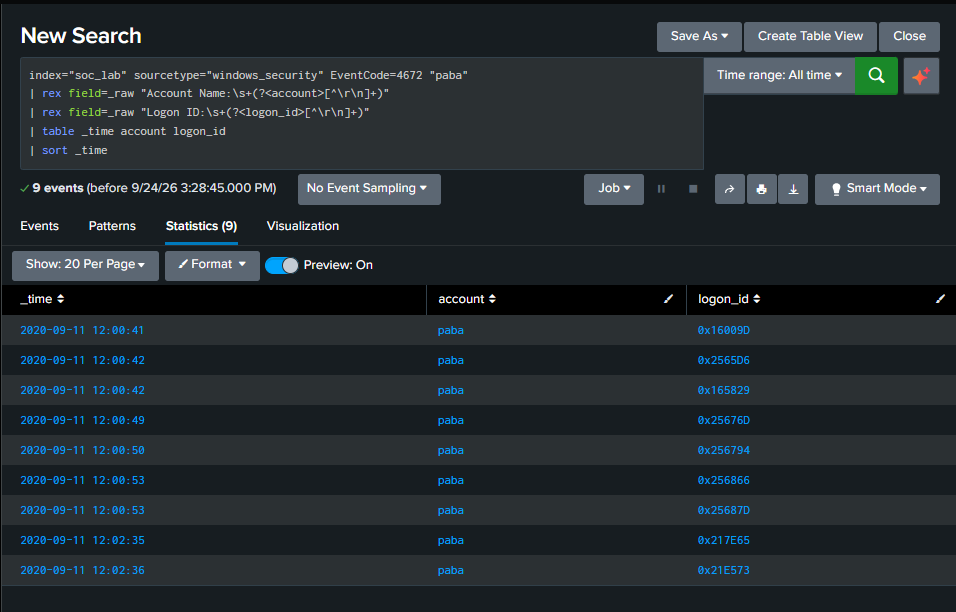

### Account Management Activity

Windows account management events were then analysed to understand how the account appeared in the environment.

The investigation identified activity including:

- Event ID 4720 – user account created
- Event ID 4722 – user account enabled
- Event ID 4724 – password reset attempted
- Event ID 4738 – user account changed

The account management events show `Administrator` performing several actions involving `paba`.

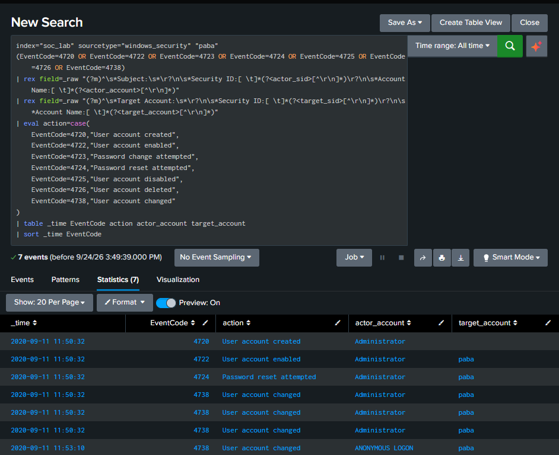

### Explicit Credential Usage

Event ID **4648** was investigated to identify events where credentials were explicitly supplied.

Activity involving both `Administrator` and `paba` was observed, including events associated with the source address `95.90.199.65`.

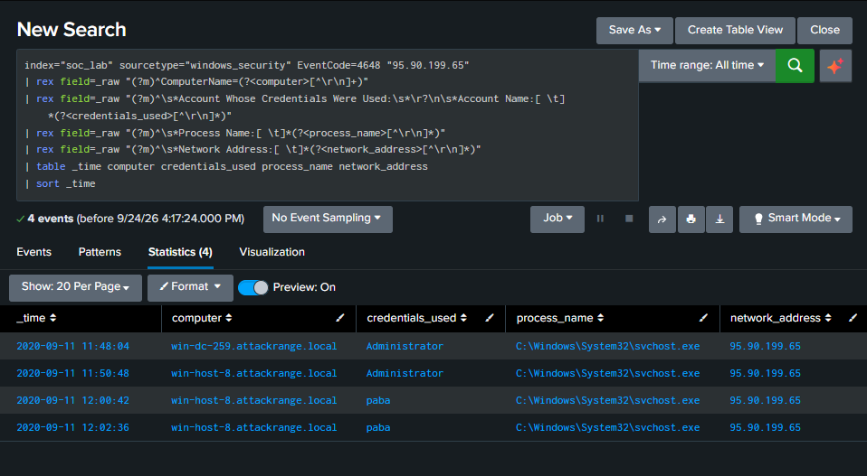

## Incident Timeline

Relevant authentication, account management, privilege, and credential events were combined into a single timeline.

This made it easier to correlate activity across multiple Windows Event IDs and observe how the behaviour developed over time.

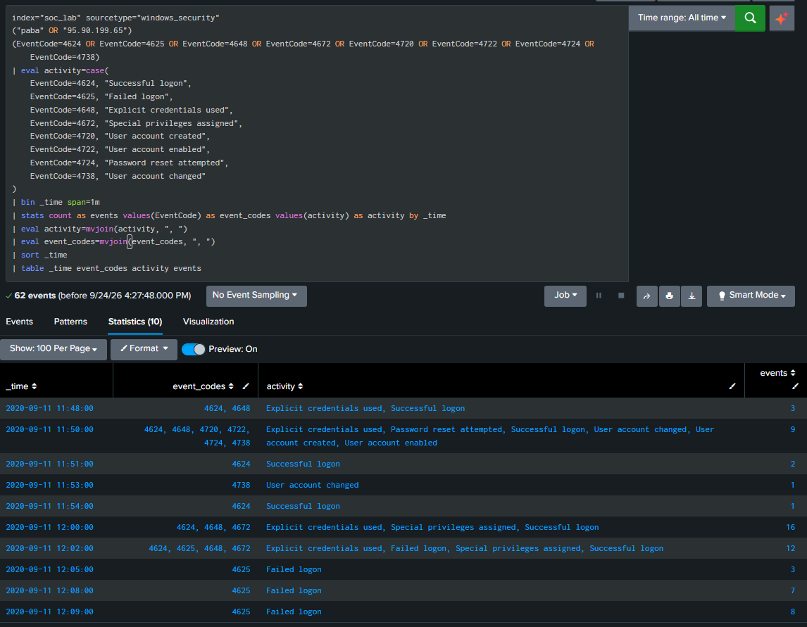

The timeline showed account management activity followed by authentication activity involving `paba`, including successful logons, privileged sessions, and a later concentration of failed authentication attempts.

## Detection Engineering

Following the investigation, two SPL detection searches were created.

### Detection 1 – Repeated Failed Logons

This detection identifies accounts receiving at least five failed logon attempts from the same source within a five minute window.

The dataset produced two periods of repeated failures against `paba` from `95.90.199.65`:

- 6 failed attempts between 12:02:12 and 12:02:29
- 18 failed attempts between 12:05:15 and 12:09:59

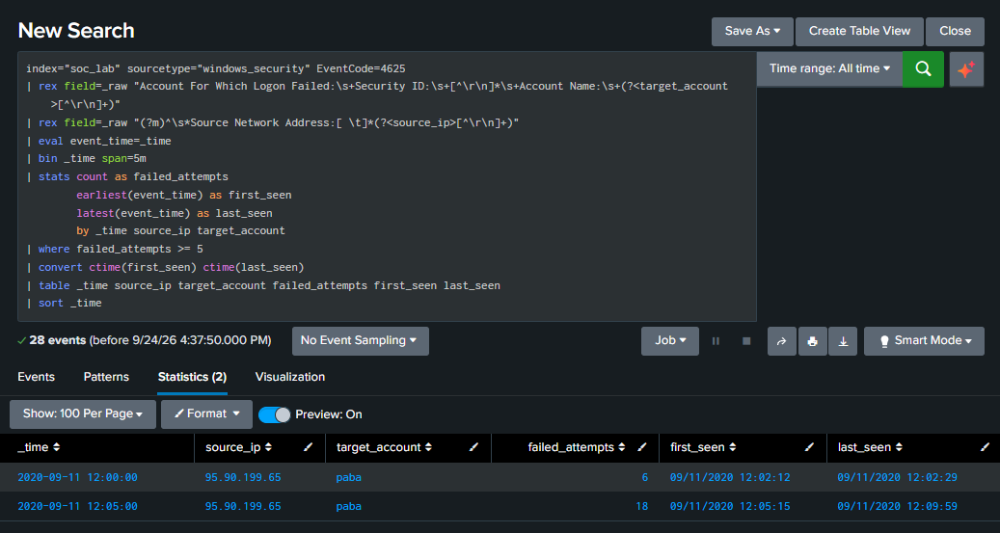

The complete SPL detection is available in:

`detections/repeated-failed-logons.spl`

### Detection 2 – Rapid Logon After Account Creation

The second detection correlates account creation events with successful logons and identifies accounts used within five minutes of being created.

The search identified `paba`:

- Account created: **11:50:32**
- First successful logon: **11:51:16**
- Time between creation and first logon: **44 seconds**
- First logon source: **95.90.199.65**

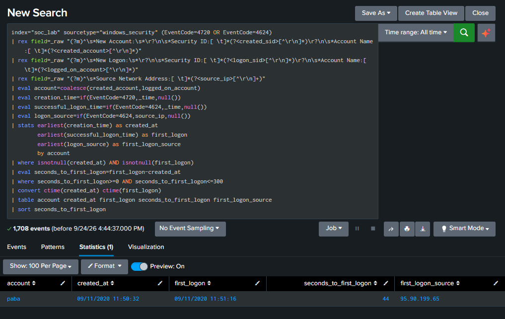

Rapid use of a newly created account is not necessarily malicious, but it can provide a useful detection signal when correlated with other suspicious authentication or account activity.

The complete SPL detection is available in:

`detections/rapid-logon-after-account-creation.spl`

## Key Findings

The investigation identified a sequence of activity involving the `paba` account:

1. The account was created and enabled.
2. The account successfully logged on 44 seconds after creation.
3. Authentication activity was associated with `95.90.199.65`.
4. Special privilege events were recorded for the account.
5. Multiple failed authentication attempts later originated from `95.90.199.65`.
6. Repeated failed logons were detected, including 18 failed attempts within a five-minute period.

These events were treated as indicators for investigation rather than individual proof of malicious activity. Correlating the events provided greater context than analysing each Event ID independently.

## Skills Demonstrated

This project demonstrates practical experience with:

- Splunk log ingestion and sourcetype configuration
- SPL searching and data analysis
- Windows Security Event ID analysis
- Authentication investigation
- Event correlation and timeline reconstruction
- Basic detection engineering
- Investigation of account and privilege activity
- SOC dashboard development
- Security investigation documentation

## Disclaimer

This project was completed as a security learning and portfolio exercise using a simulated Windows/Active Directory security dataset. The activity and IP addresses shown in the dataset should not be interpreted as evidence of real-world malicious activity.
